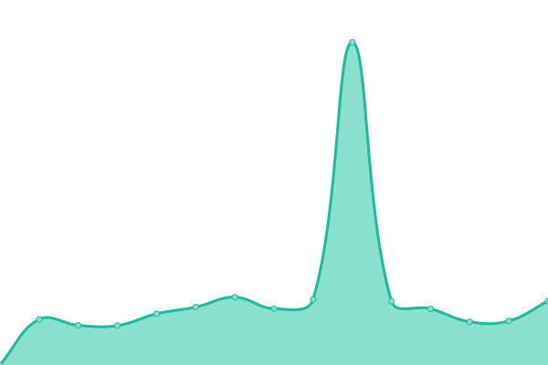
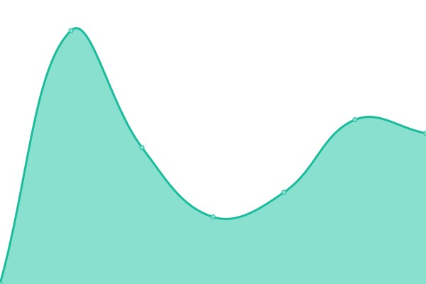
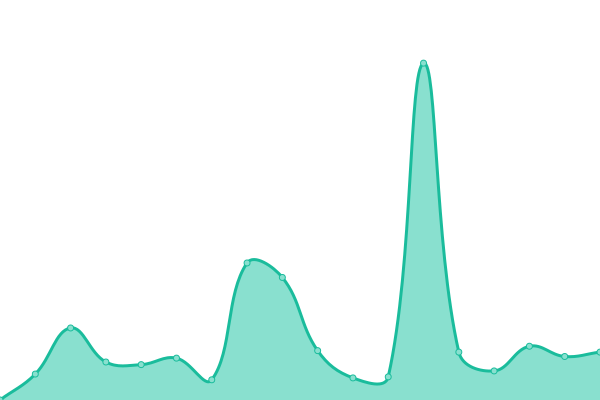
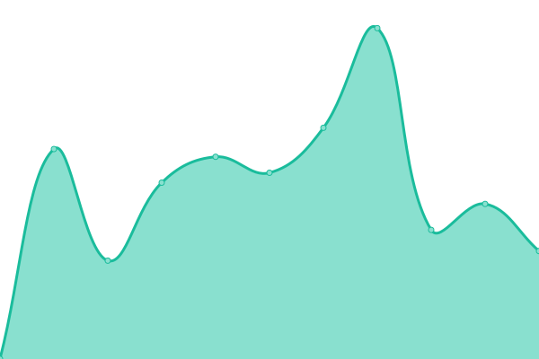
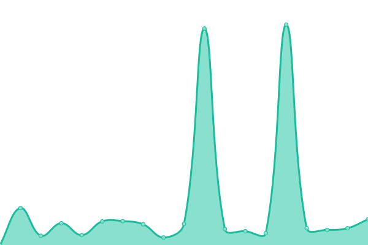
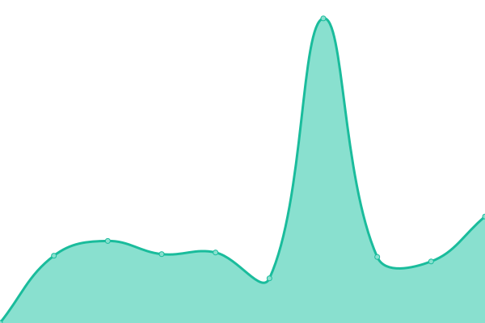

# [📈 Live Status](https://script26.github.io/uptime): <!--live status--> **🟧 Partial outage**

This repository contains the open-source uptime monitor and status page for [script26](https://script26.github.io/uptime), powered by [Upptime](https://github.com/upptime/upptime).

With [Upptime](https://upptime.js.org), you can get your own unlimited and free uptime monitor and status page, powered entirely by a GitHub repository. We use [Issues](https://github.com/script26/uptime/issues) as incident reports, [Actions](https://github.com/script26/uptime/actions) as uptime monitors, and [Pages](https://script26.github.io/uptime) for the status page.

<!--start: status pages-->
<!-- This summary is generated by Upptime (https://github.com/upptime/upptime) -->
<!-- Do not edit this manually, your changes will be overwritten -->
<!-- prettier-ignore -->
| URL | Status | History | Response Time | Uptime |
| --- | ------ | ------- | ------------- | ------ |
|  [home](https://bzmb.eu) | 🟩 Up | [home.yml](https://github.com/script26/uptime/commits/HEAD/history/home.yml) | 

 946ms
     
 | 

<a href="https://script26.github.io/uptime/history/home">98.66%</a>
    

|  [img](https://img.bzmb.eu) | 🟥 Down | [img.yml](https://github.com/script26/uptime/commits/HEAD/history/img.yml) | 

 6328ms
     
 | 

<a href="https://script26.github.io/uptime/history/img">0.00%</a>
    

|  [vid](https://vid.bzmb.eu) | 🟥 Down | [vid.yml](https://github.com/script26/uptime/commits/HEAD/history/vid.yml) | 

 6155ms
     
 | 

<a href="https://script26.github.io/uptime/history/vid">0.00%</a>
    

|  [search](https://search.bzmb.eu) | 🟩 Up | [search.yml](https://github.com/script26/uptime/commits/HEAD/history/search.yml) | 

 1226ms
     
 | 

<a href="https://script26.github.io/uptime/history/search">98.69%</a>
    

|  [agar](https://agar.bzmb.eu) | 🟩 Up | [agar.yml](https://github.com/script26/uptime/commits/HEAD/history/agar.yml) | 

 1008ms
     
 | 

<a href="https://script26.github.io/uptime/history/agar">98.71%</a>
    

|  [craft](https://craft.bzmb.eu) | 🟥 Down | [craft.yml](https://github.com/script26/uptime/commits/HEAD/history/craft.yml) | 

 737ms
     
 | 

<a href="https://script26.github.io/uptime/history/craft">0.00%</a>
    

|  [lyrics](https://lyrics.bzmb.eu) | 🟩 Up | [lyrics.yml](https://github.com/script26/uptime/commits/HEAD/history/lyrics.yml) | 

 892ms
     
 | 

<a href="https://script26.github.io/uptime/history/lyrics">98.81%</a>
    

<!--end: status pages-->

[**Visit our status website →**](https://script26.github.io/uptime)

## 📄 License

- Powered by: [Upptime](https://github.com/upptime/upptime)
- Code: [MIT](./LICENSE) © [Anand Chowdhary](https://anandchowdhary.com), supported by [Pabio](https://pabio.com)
- Data in the `./history` directory: [Open Database License](https://opendatacommons.org/licenses/odbl/1-0/)
